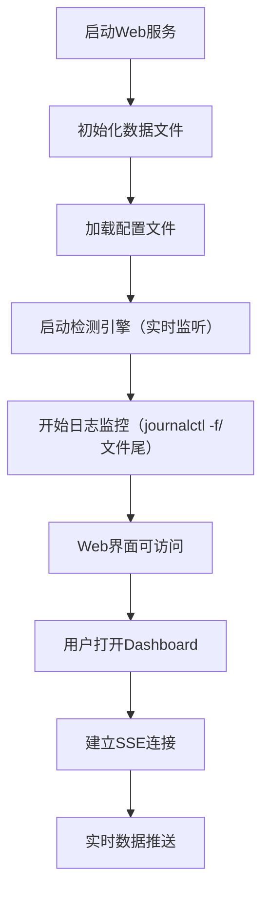
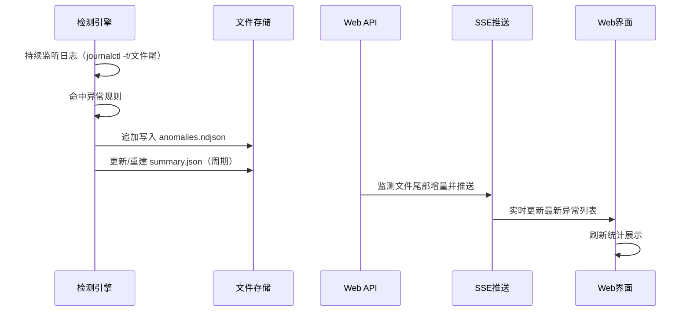
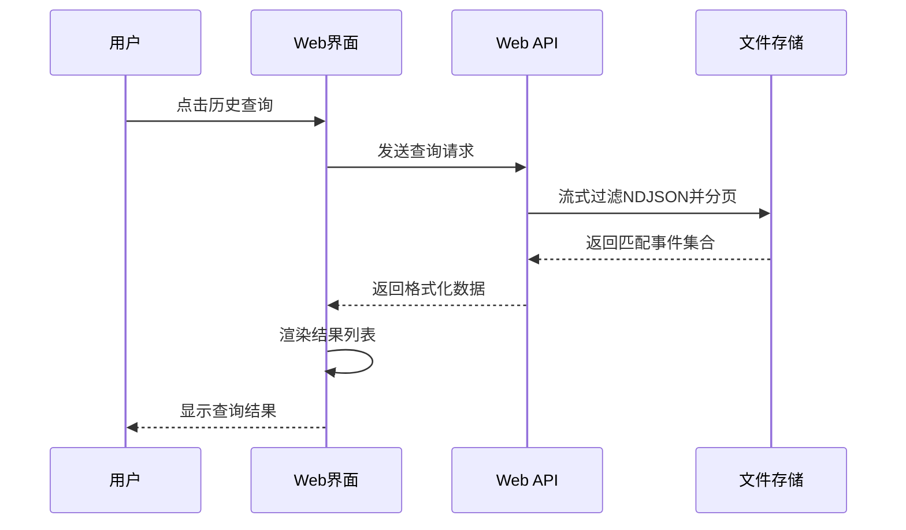

# Linux系统异常检测工具 - 功能设计文档

## 📋 文档信息
- **文档名称**：单系统异常检测功能设计规格说明书
- **版本**：v1.0（实时检测 + 分布式 + AI分析）
- **作者**：系统软件课设团队
- **创建日期**：2024年
- **最后更新**：2024年

## 🎯 文档目的

本文档详细描述了针对Linux系统的异常检测工具的功能设计，基于现有Python检测引擎，增加现代化Web界面和基础实时监控功能，为系统运维人员提供简洁高效的异常监控解决方案。

## 🏗️ 系统功能架构（实时版 + 分布式扩展）

### 总体功能架构图

```
┌─────────────────────────────────────────────────────────────────────────┐
│                        用户界面层（Web界面）                               │
├─────────────────────────────────────────────────────────────────────────┤
│  ┌─────────────┐  ┌─────────────┐  ┌─────────────┐                    │
│  │  监控面板    │  │  历史查询    │   │  配置管理    │                    │
│  │  Dashboard  │  │  History    │  │  Settings   │                    │
│  └─────────────┘  └─────────────┘  └─────────────┘                    │
└─────────────────────────────────────────────────────────────────────────┘
                                    │
                                    ▼
┌─────────────────────────────────────────────────────────────────────────┐
│                         应用服务层（轻量级服务）                            │
├─────────────────────────────────────────────────────────────────────────┤
│  ┌─────────────┐  ┌─────────────┐  ┌─────────────┐                    │
│  │  实时监控    │  │  数据管理    │  │  配置服务    │                    │
│  │  Monitor    │  │  Data Mgmt  │  │  Config     │                    │
│  └─────────────┘  └─────────────┘  └─────────────┘                    │
└─────────────────────────────────────────────────────────────────────────┘
                                    │
                                    ▼
┌─────────────────────────────────────────────────────────────────────────┐
│                      核心业务层（现有Python引擎增强）                         │
├─────────────────────────────────────────────────────────────────────────┤
│  ┌─────────────┐  ┌─────────────┐  ┌─────────────┐  ┌─────────────┐    │
│  │  异常检测    │  │  日志解析    │  │  数据存储    │  │  统计分析    │    │
│  │  Detection  │  │  Parser     │  │  Storage    │  │  Statistics │    │
│  └─────────────┘  └─────────────┘  └─────────────┘  └─────────────┘    │
└─────────────────────────────────────────────────────────────────────────┘
                                    │
                                    ▼
┌─────────────────────────────────────────────────────────────────────────┐
│                           数据层（本地存储）                                │
├─────────────────────────────────────────────────────────────────────────┤
│  ┌─────────────┐  ┌─────────────┐  ┌─────────────┐                    │
│  │  数据文件    │  │  日志文件    │  │  配置文件    │                    │
│  │  Data Files │  │  Log Files  │  │  Config     │                    │
│  └─────────────┘  └─────────────┘  └─────────────┘                    │
└─────────────────────────────────────────────────────────────────────────┘
```

### 分布式扩展架构图

```
┌─────────────────────────────────────────────────────────────────────────┐
│                         中心聚合服务（Aggregator）                        │
├─────────────────────────────────────────────────────────────────────────┤
│  Web界面（Dashboard/History/Settings） · REST API · SSE实时推送           │
│  存储（NDJSON/summary.json） · AI分析与建议模块                           │
└─────────────────────────────────────────────────────────────────────────┘
             ▲                                        ▲
             │                                        │
     上报（POST /api/ingest）                 读取/推送（REST/SSE）
             │                                        │
┌────────────┴────────────┐                 ┌─────────┴─────────┐
│     Agent（主机A）       │                 │     前端用户       │
├──────────────────────────┤                 ├────────────────────┤
│ 实时监听日志（journalctl -f/文件尾）       │ 浏览器订阅SSE      │
│ 命中规则→事件打包（含host_id）             │ 查看统计与历史     │
│ 批量上报中心（带token鉴权）                │                   │
└──────────────────────────┘                 └────────────────────┘

┌────────────┴────────────┐
│     Agent（主机B）       │  ... 多主机并行
└──────────────────────────┘
```

## 🎛️ 核心功能模块设计（简化版）

### 1. Web监控面板（Web Dashboard）

#### 1.1 功能描述
提供简洁的Web界面，展示当前系统的异常检测状态和基本信息，替代原有的命令行输出方式。

#### 1.2 界面设计

**监控面板布局**：
```
┌─────────────────────────────────────────────────────────────┐
│  🖥️ Linux系统异常监控 - localhost                          刷新    │
├─────────────────────────────────────────────────────────────┤
│                                                             │
│  ┌─────────────┐  ┌─────────────┐  ┌─────────────┐         │
│  │ 今日异常总数 │  │ 严重异常数   │  │ 检测状态    │         │
│  │     45      │  │      3      │  │  🟢 运行中   │         │
│  └─────────────┘  └─────────────┘  └─────────────┘         │
│                                                             │
│  ┌──────────────────────────────────────────────────────────┐ │
│  │ 最新异常事件                                             │ │
│  │ ┌──────────────────────────────────────────────────────┐ │ │
│  │ │ 🔴 14:23:45 [严重] 内存溢出 - /var/log/kern.log:1234  │ │ │
│  │ │ 🟡 14:22:30 [一般] 磁盘空间不足 - /var/log/syslog:567 │ │ │
│  │ │ 🟢 14:21:15 [轻微] 网络超时 - /var/log/messages:789  │ │ │
│  │ └──────────────────────────────────────────────────────┘ │ │
│  └──────────────────────────────────────────────────────────┘ │
│                                                             │
│  ┌──────────────────────────────────────────────────────────┐ │
│  │ 异常类型分布                                             │ │
│  │ [饼图：内存35%|磁盘30%|网络20%|其他15%]                  │ │
│  └──────────────────────────────────────────────────────────┘ │
└─────────────────────────────────────────────────────────────┘
```

#### 1.3 功能特性
- **实时状态显示**：当前检测状态、异常统计
- **异常事件列表**：显示最近10条异常记录
- **基本图表展示**：简单的饼图显示异常类型分布
- **手动刷新**：支持手动刷新数据
- **自动刷新**：可选30秒自动刷新

### 2. 异常检测增强（Enhanced Detection）

#### 2.1 基于现有引擎的扩展
在现有Python检测引擎基础上，增加以下功能：

**2.1.1 检测结果结构化存储**
```python
class EnhancedDetector(BaseDetector):
    def __init__(self, config, db_connection):
        super().__init__(config)
        self.db = db_connection
        
    def detect_and_store(self, log_line, source_file, line_number):
        """检测异常并存储结果"""
        result = self.detect(log_line)
        if result:
            # 增强数据结构
            enhanced_result = {
                'id': self.generate_id(),
                'type': result['type'],
                'severity': result['severity'],
                'message': result['message'],
                'source_file': source_file,
                'line_number': line_number,
                'detected_at': datetime.now(),
                'host': socket.gethostname(),
                'processed': False
            }
            # 存储到数据库
            self.store_anomaly(enhanced_result)
            return enhanced_result
        return None
```

**2.1.2 检测统计信息生成**
```python
def get_detection_stats(hours=24):
    """生成检测统计信息"""
    return {
        'total_anomalies': count_total_anomalies(hours),
        'by_severity': count_by_severity(hours),
        'by_type': count_by_type(hours),
        'trend': get_trend_data(hours),
        'last_detection': get_last_detection_time()
    }
```

#### 2.2 检测类型保持现有6种
- **OOM检测**：内存溢出异常
- **内核恐慌**：Kernel Panic检测
- **系统重启**：异常重启检测
- **文件系统异常**：FS错误检测
- **Oops异常**：内核Oops检测
- **死锁检测**：系统死锁识别

### 3. 历史数据管理（History Management）

#### 3.1 功能描述
提供简单的历史异常数据查询和浏览功能，支持基本的时间筛选和类型筛选。

#### 3.2 查询界面设计

**历史查询界面**：
```
┌─────────────────────────────────────────────────────────────┐
│  📅 历史异常查询                                          返回    │
├─────────────────────────────────────────────────────────────┤
│                                                             │
│  查询条件：                                                  │
│  时间范围：[今日] [近7天] [近30天] [自定义]                  │
│  异常类型：[全部] [严重] [一般] [轻微]                      │
│  关键词搜索：_______________ [搜索]                          │
│                                                             │
│  ┌──────────────────────────────────────────────────────────┐ │
│  │ 查询结果（找到 156 条记录）                               │ │
│  │ ┌──────────────────────────────────────────────────────┐ │ │
│  │ │ 🔴 2024-01-19 14:23:45 内存溢出 - 严重 - kern.log     │ │ │
│  │ │ 🟡 2024-01-19 14:22:30 磁盘不足 - 一般 - syslog       │ │ │
│  │ │ 🟢 2024-01-19 14:21:15 网络超时 - 轻微 - messages     │ │ │
│  │ │ ...                                                    │ │ │
│  │ └──────────────────────────────────────────────────────┘ │ │
│  └──────────────────────────────────────────────────────────┘ │
│                                                             │
│  [上一页] 第 1/16 页 [下一页]                                │
└─────────────────────────────────────────────────────────────┘
```

#### 3.3 功能特性
- **时间筛选**：预设时间范围和自定义时间
- **级别筛选**：按严重级别过滤
- **关键词搜索**：支持异常描述关键词搜索
- **分页显示**：每页显示20条记录
- **详情查看**：点击记录查看完整信息

### 4. 配置管理（Configuration Management）

#### 4.1 功能描述
提供Web界面的配置管理，替代原有的YAML文件配置方式。

#### 4.2 配置界面设计

**配置管理界面**：
```
┌─────────────────────────────────────────────────────────────┐
│  ⚙️ 系统配置                                              保存    │
├─────────────────────────────────────────────────────────────┤
│                                                             │
│  检测配置：                                                  │
│  ┌──────────────────────────────────────────────────────────┐ │
│  │ 监控路径：                                               │ │
│  │ • /var/log [✓]                                         │ │
│  │ • /opt/app/logs [✓]                                    │ │
│  │ • ________________ [+添加路径]                         │ │
│  │                                                       │ │
│  │ 扫描间隔：_____ 秒 （默认：60秒）                      │ │
│  │ 数据保留：_____ 天 （默认：30天）                      │ │
│  └──────────────────────────────────────────────────────────┘ │
│                                                             │
│  告警配置：                                                  │
│  ┌──────────────────────────────────────────────────────────┐ │
│  │ 启用邮件通知：[✓]                                       │ │
│  │ 邮件地址：_______@_______                              │ │
│  │ 严重异常立即通知：[✓]                                   │ │
│  │ 静默期：_____ 分钟 （默认：30分钟）                    │ │
│  └──────────────────────────────────────────────────────────┘ │
│                                                             │
│  显示配置：                                                  │
│  ┌──────────────────────────────────────────────────────────┐ │
│  │ 自动刷新：[✓] 间隔：_____ 秒 （默认：30秒）            │ │
│  │ 每页显示：_____ 条 （默认：20条）                      │ │
│  │ 时间格式：24小时制 [✓]                                  │ │
│  └──────────────────────────────────────────────────────────┘ │
└─────────────────────────────────────────────────────────────┘
```

#### 4.3 配置项说明
- **监控路径**：支持添加多个日志目录
- **扫描间隔**：检测引擎扫描频率
- **数据保留**：历史数据保存时长
- **邮件通知**：基础邮件告警配置
- **显示设置**：界面显示偏好

### 5. 轻量级Web服务（Lightweight Web Server）

#### 5.1 技术选型
- **后端框架**：Python Flask（轻量级，易于集成）
- **前端框架**：原生JavaScript + Bootstrap（减少构建复杂度）
- **文件存储**：NDJSON/JSON 文件（零配置，追加写入）
- **实时通信**：Server-Sent Events（比WebSocket更简单）
 - **实时检测**：journalctl -f 或文件尾部监听（轮询/事件驱动）

#### 5.2 各模块实现框架

**5.2.1 监控面板模块实现框架**
```python
# web/app.py - 监控面板路由
@app.route('/')
def dashboard():
    stats = get_anomaly_stats()
    recent_anomalies = get_recent_anomalies(limit=10)
    return render_template('dashboard.html', 
                         stats=stats, 
                         anomalies=recent_anomalies)

def get_anomaly_stats():
    """获取异常统计信息"""
    conn = sqlite3.connect('data/anomalies.db')
    cursor = conn.cursor()
    
    # 今日异常统计
    today_count = cursor.execute("""
        SELECT COUNT(*) FROM anomalies 
        WHERE DATE(detected_at) = DATE('now')
    """).fetchone()[0]
    
    # 严重异常统计
    critical_count = cursor.execute("""
        SELECT COUNT(*) FROM anomalies 
        WHERE severity = 'critical' AND DATE(detected_at) = DATE('now')
    """).fetchone()[0]
    
    conn.close()
    
    return {
        'today_total': today_count,
        'critical_count': critical_count,
        'status': 'running'
    }
```

**5.2.2 异常检测模块实现框架**
```python
# src/enhanced_detector.py
import sqlite3
from datetime import datetime
from src.detectors.base_detector import BaseDetector

class SingleSystemDetector:
    def __init__(self, config, db_path):
        self.config = config
        self.db_path = db_path
        self.detectors = self.load_detectors()
        
    def scan_and_detect(self):
        """扫描日志并检测异常"""
        for log_path in self.config['log_paths']:
            if os.path.exists(log_path):
                self.process_log_file(log_path)
                
    def process_log_file(self, file_path):
        """处理单个日志文件"""
        try:
            with open(file_path, 'r', encoding='utf-8', errors='ignore') as f:
                line_num = 0
                for line in f:
                    line_num += 1
                    self.check_line(line, file_path, line_num)
        except Exception as e:
            print(f"Error processing {file_path}: {e}")
            
    def check_line(self, line, file_path, line_num):
        """检查单行日志"""
        for detector in self.detectors:
            result = detector.detect(line)
            if result:
                self.store_anomaly(result, file_path, line_num)
                break
                
    def store_anomaly(self, anomaly, file_path, line_num):
        """存储异常到数据库"""
        conn = sqlite3.connect(self.db_path)
        cursor = conn.cursor()
        
        cursor.execute("""
            INSERT INTO anomalies 
            (anomaly_type, severity, message, source_file, line_number, detected_at)
            VALUES (?, ?, ?, ?, ?, ?)
        """, (
            anomaly['type'],
            anomaly['severity'], 
            anomaly['message'],
            file_path,
            line_num,
            datetime.now()
        ))
        
        conn.commit()
        conn.close()
```

**5.2.3 历史数据管理模块实现框架**
```python
# web/app.py - 历史查询功能
@app.route('/api/anomalies')
def api_anomalies():
    """获取异常列表"""
    page = int(request.args.get('page', 1))
    limit = int(request.args.get('limit', 20))
    severity = request.args.get('severity', 'all')
    days = int(request.args.get('days', 7))
    
    conn = sqlite3.connect('data/anomalies.db')
    cursor = conn.cursor()
    
    # 构建查询条件
    conditions = ["detected_at >= datetime('now', '-{} days')".format(days)]
    if severity != 'all':
        conditions.append("severity = '{}'".format(severity))
    
    where_clause = ' AND '.join(conditions) if conditions else '1=1'
    
    # 获取总数
    count_query = "SELECT COUNT(*) FROM anomalies WHERE {}".format(where_clause)
    total = cursor.execute(count_query).fetchone()[0]
    
    # 获取分页数据
    offset = (page - 1) * limit
    data_query = """
        SELECT * FROM anomalies 
        WHERE {} 
        ORDER BY detected_at DESC 
        LIMIT {} OFFSET {}
    """.format(where_clause, limit, offset)
    
    anomalies = cursor.execute(data_query).fetchall()
    conn.close()
    
    return jsonify({
        'code': 200,
        'data': {
            'total': total,
            'page': page,
            'limit': limit,
            'items': [dict(zip([d[0] for d in cursor.description], row)) for row in anomalies]
        }
    })
```

**5.2.4 配置管理模块实现框架**
```python
# src/config_manager.py
import json
import os

class ConfigManager:
    def __init__(self, config_path):
        self.config_path = config_path
        self.config = self.load_config()
    
    def load_config(self):
        """加载配置文件"""
        if os.path.exists(self.config_path):
            with open(self.config_path, 'r') as f:
                return json.load(f)
        else:
            return self.get_default_config()
    
    def save_config(self, config):
        """保存配置文件"""
        with open(self.config_path, 'w') as f:
            json.dump(config, f, indent=2)
        self.config = config
    
    def get_default_config(self):
        """获取默认配置"""
        return {
            "detection": {
                "scan_interval": 60,
                "log_paths": ["/var/log", "/opt/app/logs"],
                "retention_days": 30,
                "enabled_detectors": ["oom", "panic", "reboot", "filesystem"]
            },
            "web": {
                "host": "localhost",
                "port": 8080,
                "auto_refresh": 30,
                "page_size": 20
            },
            "notification": {
                "enabled": False,
                "email": "",
                "notify_critical": True,
                "silent_period": 30
            }
        }
```

#### 5.2 API接口设计

**RESTful API规范**：
```
# 获取统计信息
GET  /api/stats
# 获取异常列表
GET  /api/anomalies?page=1&limit=20&severity=all&days=7
# 获取异常详情
GET  /api/anomalies/{id}
# 搜索异常
GET  /api/search?q=memory&days=30
# 主机统计（分布式）
GET  /api/hosts/stats
# 事件上报（Agent→Aggregator）
POST /api/ingest
# 获取配置
GET  /api/config
# 更新配置
PUT  /api/config
# 实时事件流
GET  /api/events/stream
```

**响应格式示例**：
```json
{
  "code": 200,
  "message": "success",
  "data": {
    "total_anomalies": 156,
    "by_severity": {
      "critical": 12,
      "major": 45,
      "minor": 99
    },
    "by_type": {
      "oom": 15,
      "panic": 2,
      "reboot": 8,
      "filesystem": 25
    },
    "last_update": "2024-01-19T14:23:45Z",
    "by_host": {
      "host-a": 87,
      "host-b": 69
    }
  }
}
```

#### 5.3 Server-Sent Events实现

**实时数据推送**：
```python
@app.route('/api/events/stream')
def event_stream():
    def generate():
        while True:
            # 检查新异常
            new_anomalies = check_new_anomalies()  # 读取文件尾部增量
            if new_anomalies:
                yield f"data: {json.dumps(new_anomalies)}\n\n"
            time.sleep(5)  # 5秒检查一次
    
    return Response(generate(), mimetype="text/event-stream")
```

## 🔄 功能交互流程（单系统版）

### 系统启动流程



### 异常检测与展示流程（实时版）



### 用户查询流程（文件版）



## 📊 文件存储设计（单系统版）

### 文件与目录结构

- `data/anomalies.ndjson`：主数据文件，按行存储异常事件（NDJSON）。
- `data/anomalies/YYYY-MM-DD.ndjson`：按日滚动的归档文件，便于保留与清理。
- `data/summary.json`：统计汇总文件（总数、类型分布、级别汇总、最近更新时间）。

### NDJSON事件结构
```json
{
  "id": "20240119-00001234",
  "host_id": "host-a",
  "hostname": "prod-a",
  "anomaly_type": "oom",
  "severity": "critical",
  "message": "Out of memory: Killed process 1234",
  "source_file": "/var/log/kern.log",
  "line_number": 1234,
  "detected_at": "2024-01-19T14:23:45Z",
  "ingested_at": "2024-01-19T14:23:46Z",
  "processed": false
}
```

### 汇总文件结构（summary.json）
```json
{
  "total_anomalies": 156,
  "by_severity": { "critical": 12, "major": 45, "minor": 99 },
  "by_type": { "oom": 15, "panic": 2, "reboot": 8, "filesystem": 25 },
  "last_update": "2024-01-19T14:23:45Z"
}
```

### 保留与清理策略
- 配置 `retention_days` 控制保留天数。
- 每日生成 `YYYY-MM-DD.ndjson`；超过保留天数的文件自动删除。
- `summary.json` 每 30–60 秒重算（或在新增事件后异步更新）。

### Agent 上报事件示例（POST /api/ingest）
```json
{
  "token": "<agent-token>",
  "host_id": "host-a",
  "hostname": "prod-a",
  "batch": [
    {
      "id": "host-a-20240119-142345-001",
      "anomaly_type": "oom",
      "severity": "critical",
      "message": "Out of memory: Killed process 1234",
      "source_file": "/var/log/kern.log",
      "line_number": 1234,
      "detected_at": "2024-01-19T14:23:45Z"
    }
  ]
}
```

### 配置文件结构

**config.json**（替代原有的YAML配置）：
```json
{
  "detection": {
    "scan_interval": 60,
    "log_paths": ["/var/log", "/opt/app/logs"],
    "retention_days": 30,
    "enabled_detectors": ["oom", "panic", "reboot", "filesystem"]
  },
  "web": {
    "host": "localhost",
    "port": 8080,
    "auto_refresh": 30,
    "page_size": 20
  },
  "notification": {
    "enabled": false,
    "email": "",
    "notify_critical": true,
    "silent_period": 30
  }
}
```

## 🎯 功能验收标准（单系统版）

### 核心功能验收

#### ✅ 必须完成（P0）
- [ ] 现有检测引擎集成：6种异常类型检测正常工作
- [ ] Web界面展示：基础Dashboard显示异常统计
- [ ] 历史数据查询：支持时间范围和级别筛选
- [ ] 配置管理：Web界面配置检测参数
- [ ] 本地数据存储：文件存储（NDJSON/JSON）与查询

#### ⚡ 重要功能（P1）
- [ ] 实时状态更新：Server-Sent Events推送（基于文件尾部变化）
- [ ] 基础图表展示：饼图显示异常分布
- [ ] 异常详情查看：点击查看完整异常信息
- [ ] 搜索功能：关键词搜索异常记录（流式过滤）
- [ ] 配置持久化：配置修改后保存生效

#### 🔮 可选功能（P2）
- [ ] 邮件通知：基础邮件告警功能
- [ ] 数据导出：支持CSV格式导出
- [ ] 趋势图表：简单的时间趋势图
- [ ] 多语言支持：中英文界面切换

### 性能要求（单系统）

#### 响应时间
- **页面加载**：< 1秒（本地访问）
- **查询响应**：< 300ms（1000条数据）
- **状态更新**：< 5秒（SSE推送间隔）

#### 资源使用
- **内存占用**：< 100MB（Web服务+检测引擎）
- **CPU使用**：< 10%（空闲时），< 30%（检测时）
- **磁盘空间**：< 500MB（30天数据+程序）

#### 并发能力
- **并发用户**：支持5个并发用户
- **Web连接**：支持20个并发连接
- **检测性能**：100MB日志文件< 10秒

### 兼容性要求

#### 系统兼容性
- **Linux发行版**：Ubuntu 18.04+, CentOS 7+, Debian 9+
- **Python版本**：Python 3.7+
- **浏览器支持**：Chrome 80+, Firefox 75+, Safari 13+

#### 依赖要求
- **系统依赖**：systemd（可选）
- **Python包**：flask, datetime, json, pathlib（可选 orjson 提升性能）
- **前端依赖**：Bootstrap 5（CDN引入）

## 🔧 技术实现方案（单系统版）
（本节实现方案在分布式扩展中维持不变，中心服务作为聚合点；Agent 以实时监听与批量上报对接中心）

### 项目结构（实时检测版）

```
linux-anomaly-monitor/
├── src/
│   ├── web/                    # Web服务
│   │   ├── app.py             # Flask主程序
│   │   ├── templates/         # HTML模板
│   │   │   ├── dashboard.html
│   │   │   ├── history.html
│   │   │   └── settings.html
│   │   └── static/            # 静态文件
│   │       ├── css/style.css
│   │       └── js/app.js
│   ├── enhanced_detector.py   # 实时检测引擎（文件写入）
│   └── config_manager.py      # 配置管理
├── config/
│   └── config.json            # 配置文件
├── data/
│   ├── anomalies.ndjson       # 主数据文件
│   ├── anomalies/             # 按日滚动归档
│   └── summary.json           # 汇总文件
├── logs/
│   └── monitor.log            # 运行日志
├── requirements.txt           # Python依赖
├── start_web.py              # Web启动脚本
├── start_detector.py         # 检测引擎启动脚本
└── README.md                 # 使用说明
```

### 关键技术实现（文件存储版）

#### Flask Web服务
```python
from flask import Flask, render_template, jsonify, request, Response
import json, os, time
from datetime import datetime

app = Flask(__name__)

@app.route('/')
def dashboard():
    stats = load_summary()
    recent = list(iter_recent_anomalies(limit=10))
    return render_template('dashboard.html', stats=stats, anomalies=recent)

@app.route('/api/stats')
def api_stats():
    stats = load_summary()
    return jsonify({'code': 200, 'data': stats})

@app.route('/api/anomalies')
def api_anomalies():
    page = int(request.args.get('page', 1))
    limit = int(request.args.get('limit', 20))
    severity = request.args.get('severity', 'all')
    days = int(request.args.get('days', 7))
    host = request.args.get('host_id')
    items = filter_anomalies(days=days, severity=severity, host_id=host)
    start = (page - 1) * limit
    end = start + limit
    total = len(items)
    return jsonify({'code': 200, 'data': {'total': total, 'page': page, 'limit': limit, 'items': items[start:end]}})

@app.route('/api/events/stream')
def event_stream():
    def generate():
        last_pos = 0
        while True:
            path = 'data/anomalies.ndjson'
            if os.path.exists(path):
                size = os.path.getsize(path)
                if size > last_pos:
                    with open(path, 'r', encoding='utf-8') as f:
                        f.seek(last_pos)
                        lines = f.readlines()
                        last_pos = f.tell()
                    anomalies = [json.loads(l) for l in lines if l.strip()]
                    if anomalies:
                        yield f"data: {json.dumps(anomalies, ensure_ascii=False)}\n\n"
            time.sleep(5)
    return Response(generate(), mimetype='text/event-stream')

def load_summary():
    try:
        with open('data/summary.json', 'r', encoding='utf-8') as f:
            return json.load(f)
    except Exception:
        return {"total_anomalies": 0, "by_severity": {}, "by_type": {}, "last_update": None}

def iter_recent_anomalies(limit=10):
    path = 'data/anomalies.ndjson'
    if not os.path.exists(path):
        return []
    with open(path, 'r', encoding='utf-8', errors='ignore') as f:
        lines = f.readlines()[-limit:]
        for l in reversed(lines):
            yield json.loads(l)

def filter_anomalies(days=7, severity='all', host_id=None):
    # 简化实现：只读主文件，生产中可按日文件合并
    path = 'data/anomalies.ndjson'
    if not os.path.exists(path):
        return []
    items = []
    cutoff = time.time() - days * 86400
    with open(path, 'r', encoding='utf-8', errors='ignore') as f:
        for line in f:
            try:
                obj = json.loads(line)
                ts = datetime.fromisoformat(obj.get('detected_at').replace('Z','+00:00')).timestamp() if obj.get('detected_at') else 0
                ok_sev = (severity == 'all' or obj.get('severity') == severity)
                ok_host = (not host_id or obj.get('host_id') == host_id)
                if ts >= cutoff and ok_sev and ok_host:
                    items.append(obj)
            except Exception:
                continue
    return items
```

#### 检测引擎写入
```python
import json, os
from datetime import datetime

def store_anomaly(anomaly):
    anomaly.setdefault('detected_at', datetime.utcnow().isoformat() + 'Z')
    with open('data/anomalies.ndjson', 'a', encoding='utf-8') as f:
        f.write(json.dumps(anomaly, ensure_ascii=False) + '\n')
```

#### 前端JavaScript实现
```javascript
// 实时事件流监听
function startEventStream() {
    const eventSource = new EventSource('/api/events/stream');
    
    eventSource.onmessage = function(event) {
        const data = JSON.parse(event.data);
        updateDashboard(data);
    };
    
    eventSource.onerror = function(error) {
        console.log('EventSource failed:', error);
        // 5秒后重连
        setTimeout(startEventStream, 5000);
    };
}

// 更新仪表板
function updateDashboard(data) {
    // 更新统计数字
    updateStats(data.stats);
    // 添加新异常到列表
    addNewAnomalies(data.anomalies);
    // 更新图表
    updateCharts(data.charts);
}

// 自动刷新
function setupAutoRefresh() {
    const interval = 30; // 30秒
    setInterval(function() {
        refreshDashboard();
    }, interval * 1000);
}
```

## 🚀 部署和运行（单系统）
（分布式扩展：各主机部署 Agent 进程，中心部署 Aggregator Web 服务）

### 5.3 前端Python替代方案

除了JavaScript+Bootstrap方案，还可以使用以下Python前端技术：

#### 方案1：Streamlit（最简方案）
```python
# streamlit_app.py
import streamlit as st
import json, os
from datetime import datetime

def load_summary():
    try:
        with open('data/summary.json', 'r', encoding='utf-8') as f:
            return json.load(f)
    except Exception:
        return {"total_anomalies": 0}

def iter_recent(limit=10):
    path = 'data/anomalies.ndjson'
    if not os.path.exists(path):
        return []
    with open(path, 'r', encoding='utf-8', errors='ignore') as f:
        return [json.loads(l) for l in f.readlines()[-limit:]][::-1]

def main():
    st.set_page_config(page_title="Linux异常监控", layout="wide")
    st.title("🖥️ Linux系统异常监控")

    summary = load_summary()
    col1, col2, col3 = st.columns(3)
    with col1:
        st.metric("今日异常总数", summary.get("total_anomalies", 0))
    with col2:
        st.metric("检测状态", "🟢 运行中")
    with col3:
        st.metric("最后检测", datetime.now().strftime("%H:%M:%S"))

    st.subheader("最新异常事件")
    for item in iter_recent(10):
        st.write(item)

    if st.button("刷新数据"):
        st.experimental_rerun()

if __name__ == "__main__":
    main()
```

#### 方案2：PyWebIO（交互式Web）
```python
# pywebio_app.py
from pywebio import start_server
from pywebio.output import *
from pywebio.session import run_async
import json, os, asyncio

def iter_recent(limit=10):
    path = 'data/anomalies.ndjson'
    if not os.path.exists(path):
        return []
    with open(path, 'r', encoding='utf-8', errors='ignore') as f:
        return [json.loads(l) for l in f.readlines()[-limit:]][::-1]

def main():
    put_markdown("# 🖥️ Linux系统异常监控")
    put_markdown("## 最新异常事件")
    put_scope('anomaly_list')

    async def refresh_data():
        while True:
            data = iter_recent(10)
            with use_scope('anomaly_list', clear=True):
                put_table([[d.get('detected_at'), d.get('severity'), d.get('message')] for d in data])
            await asyncio.sleep(30)

    run_async(refresh_data())

if __name__ == "__main__":
    start_server(main, port=8080, debug=True)
```

#### 方案3：FastAPI + Jinja2模板（纯Python）
```python
# fastapi_app.py
from fastapi import FastAPI, Request
from fastapi.responses import HTMLResponse
from fastapi.templating import Jinja2Templates
import json, os

app = FastAPI()
templates = Jinja2Templates(directory="templates")

@app.get("/", response_class=HTMLResponse)
def dashboard(request: Request):
    stats = load_summary()
    anomalies = iter_recent(10)
    return templates.TemplateResponse("dashboard.html", {"request": request, "stats": stats, "anomalies": anomalies})

def load_summary():
    try:
        with open('data/summary.json', 'r', encoding='utf-8') as f:
            return json.load(f)
    except Exception:
        return {"total_anomalies": 0}

def iter_recent(limit=10):
    path = 'data/anomalies.ndjson'
    if not os.path.exists(path):
        return []
    with open(path, 'r', encoding='utf-8', errors='ignore') as f:
        return [json.loads(l) for l in f.readlines()[-limit:]][::-1]
```

#### 前端方案对比
| 方案 | 优点 | 缺点 | 适合场景 |
|------|------|------|----------|
| JavaScript+Bootstrap | 标准Web技术，界面美观 | 需要学习JS | 传统Web开发 |
| Streamlit | 最简单，纯Python | 功能有限，不够专业 | 快速原型，内部工具 |
| PyWebIO | 交互性强，Pythonic | 样式受限 | 数据展示应用 |
| FastAPI+Jinja2 | 纯Python，性能好 | 需要HTML知识 | 生产级Web应用 |

### 安装部署

#### 1. 环境准备
```bash
# 安装Python依赖
pip install flask orjson requests

# 创建必要目录
mkdir -p data logs config

# 初始化配置文件
cp config/config.example.json config/config.json

# 初始化数据文件
echo "{}" > data/summary.json
touch data/anomalies.ndjson
```

#### 2. 数据文件初始化
```bash
# 可选：创建当日归档文件
touch data/anomalies/$(date +%F).ndjson
```

#### 3. 启动服务
```bash
# 中心（Aggregator）：启动Web服务
python start_web.py

# 主机（Agent）：实时监听并上报
python src/agent.py --server http://AGGREGATOR_HOST:8080 --token <TOKEN> --mode journal
```

#### 4. 访问Web界面
```
# 默认地址
http://localhost:8080

# 主要页面
/          - 监控面板
/history   - 历史查询
/settings  - 配置管理
```

### 系统服务化（可选）

#### systemd服务配置
```ini
# /etc/systemd/system/anomaly-monitor.service
[Unit]
Description=Linux Anomaly Monitor
After=network.target

[Service]
Type=simple
User=monitor
WorkingDirectory=/opt/anomaly-monitor
ExecStart=/usr/bin/python3 /opt/anomaly-monitor/start_all.py
Restart=always
RestartSec=10

[Install]
WantedBy=multi-user.target
```

#### 服务管理命令
```bash
# 启用服务
sudo systemctl enable anomaly-monitor

# 启动服务
sudo systemctl start anomaly-monitor

# 查看状态
sudo systemctl status anomaly-monitor

# 查看日志
sudo journalctl -u anomaly-monitor -f
```

## 📊 功能对比（分布式 vs 单系统）

| 功能特性 | 分布式方案 | 单系统方案 | 说明 |
|---------|------------|------------|------|
| 监控规模 | 多服务器 | 单Linux系统 | 目标场景不同 |
| 实时通信 | WebSocket | Server-Sent Events | 简化实现 |
| 存储 | 分布式存储/消息队列 | 文件（NDJSON/summary.json） | 零配置 |
| Web框架 | React+Node.js | Flask+原生JS | 轻量级 |
| 部署复杂度 | 高 | 低 | 单系统更易用 |
| 功能丰富度 | 非常丰富 | 基础够用 | 满足课设要求 |
| 开发周期 | 4-5周 | 2-3周 | 开发时间缩短 |
| 技术栈 | 复杂多样 | 简单统一 | 学习成本低 |

## 🎯 项目优势（单系统版）

### 符合课设要求
1. **工作量适中**：2-3周可完成，三人分工明确
2. **技术深度够**：涉及系统编程、Web开发、数据库
3. **非AI生成**：需要理解Linux日志结构和检测逻辑
4. **实用价值高**：解决实际系统运维问题

### 技术亮点
1. **现代化改造**：将命令行工具升级为Web界面
2. **数据持久化**：文件存储（NDJSON按行 + 按日归档）与历史查询
3. **实时展示**：Server-Sent Events实时推送
4. **轻量级架构**：Flask+原生JS，易于理解和维护

### 学习价值
1. **Linux系统编程**：日志文件处理和异常检测
2. **Web开发**：前后端交互和实时通信
3. **数据处理**：文件读写、流式过滤与归档清理
4. **系统集成**：多组件协调和部署

### 演示效果
1. **界面友好**：现代化Web界面，比命令行更直观
2. **实时性好**：异常产生后5秒内界面更新
3. **数据完整**：历史记录可查，统计分析清晰
4. **操作简便**：点击式操作，无需记忆命令

---

## 📋 开发计划与人员分工（单系统版）

### 总体分工策略
基于三人团队特点，采用"前后端分离 + 核心检测 + 集成测试"的分工模式，确保每个人都有独立负责的模块，同时保持协作集成。

### 成员A：前端界面开发工程师
**主要职责**：负责所有用户界面的设计和实现

**具体任务**：
- **Web界面开发**（40%工作量）
  - 监控面板Dashboard页面（统计卡片、异常列表、图表展示）
  - 历史查询History页面（筛选条件、分页列表、详情查看）
  - 配置管理Settings页面（表单设计、配置验证、保存功能）
  - 公共组件开发（导航栏、页脚、加载状态、错误提示）

- **前端交互逻辑**（30%工作量）
  - Server-Sent Events实时数据接收和界面更新
  - AJAX异步请求封装和错误处理
  - 表单验证和用户交互反馈
  - 响应式布局适配（PC/平板/手机）

- **界面美化优化**（30%工作量）
  - Bootstrap主题定制和样式优化
  - 图表库集成（Chart.js）和数据可视化
  - 动画效果和用户体验优化
  - 跨浏览器兼容性测试

**技术栈**：HTML5, CSS3, JavaScript ES6+, Bootstrap 5, Chart.js, AJAX, SSE

**交付物**：
- 3个完整HTML页面 + 1个公共组件库
- 完整的CSS样式文件和JavaScript交互逻辑
- 前端开发文档和使用说明

---

### 成员B：后端服务开发工程师
**主要职责**：负责后端API服务和文件数据管理

**具体任务**：
- **Flask Web服务**（35%工作量）
  - Flask应用架构设计和路由规划
  - RESTful API接口实现（/api/stats, /api/anomalies等）
  - Server-Sent Events实时推送服务
  - 请求参数验证和错误处理统一封装

- **文件存储设计开发**（35%工作量）
  - NDJSON/summary.json 文件结构与索引设计
  - 文件流式读取与分页性能优化
  - 数据访问层封装（文件读写/筛选/统计）
  - 日文件滚动与保留/清理策略实现

- **业务逻辑实现**（30%工作量）
  - 异常统计逻辑（按时间、类型、级别统计）
  - 历史数据查询服务（分页、筛选、排序）
  - 配置管理服务（读取、验证、保存配置）
  - 日志记录和系统监控

**技术栈**：Python 3.7+, Flask 2.0+, JSON, Logging, subprocess/os

**交付物**：
- 完整的Flask Web服务应用（REST + SSE）
- 文件数据访问层与汇总任务（NDJSON/summary.json）
- API接口文档和测试用例

---

### 成员C：检测引擎集成工程师
**主要职责**：负责检测引擎增强和系统集成

**具体任务**：
- **检测引擎增强**（40%工作量）
  - 现有6种检测器集成和测试验证
  - 检测结果结构化存储（统一数据格式）
  - 检测性能优化（多线程/异步处理）
  - 检测配置管理（检测间隔、日志路径等）

- **系统集成开发**（30%工作量）
  - 检测引擎与Web服务集成（数据传递机制）
  - 系统启动脚本开发（检测引擎 + Web服务）
  - 配置文件管理（JSON格式配置读写）
  - 错误处理和异常恢复机制

- **系统部署运维**（30%工作量）
  - systemd服务配置（开机自启动、守护进程）
  - 系统安装脚本和部署文档
  - 日志轮转和系统监控
  - 性能测试和调优

**技术栈**：Python 3.7+, 系统编程, systemd, Shell脚本, JSON配置

**交付物**：
- 增强版检测引擎（支持实时监听与Agent上报）
- 系统集成脚本和部署工具（Aggregator + Agent）
- 系统运维文档和故障排查指南

---

### 协作集成计划

#### 第一阶段（第1-2天）：接口定义和环境搭建
- **全团队**：需求确认和技术选型最终确定
- **A+B**：前后端接口规范制定（URL、参数、返回格式）
- **C**：开发环境搭建和基础框架初始化

#### 第二阶段（第3-5天）：并行开发
- **成员A**：前端页面框架开发
- **成员B**：后端API接口开发
- **成员C**：检测引擎增强开发

#### 第三阶段（第6-8天）：集成测试
- **A+B**：前后端联调和接口测试
- **B+C**：文件与检测引擎（Agent）集成测试
- **全团队**：系统整体功能测试

#### 第四阶段（第9-10天）：完善优化
- **全团队**：bug修复和性能优化
- **全团队**：文档编写和演示准备

---

### 技术风险与应对

#### 风险1：前后端接口不一致
- **应对**：提前制定详细的API文档，使用Postman进行接口测试

#### 风险2：文件体量膨胀
- **应对**：按日滚动、保留天数清理、增量汇总与轻量索引

#### 风险3：实时推送延迟
- **应对**：优化SSE实现，减少推送频率，增加本地缓存

#### 风险4：检测引擎兼容性
- **应对**：充分测试不同Linux发行版，准备兼容性方案

---

### 质量保障措施

#### 代码质量
- 代码审查：关键模块需要其他成员review
- 单元测试：核心业务逻辑必须有测试用例
- 文档同步：代码变更必须更新相关文档

#### 进度管控
- 每日站会：15分钟同步进展和问题
- 里程碑检查：每2天检查关键节点完成情况
- 风险预警：发现延期风险立即调整计划

#### 交付标准
- 功能完整：所有核心功能必须可用
- 界面友好：无明显UI错误和用户体验问题
- 文档齐全：用户手册、开发文档、部署指南
- 演示就绪：可以完整演示系统功能

---

**文档版本**：v1.4（实时检测 + 分布式扩展 + AI分析）  
**适用范围**：单系统为基础，可扩展分布式多机监控  
**开发周期**：2-3周  
**团队规模**：3人（前端 + 后端 + 检测集成）
## 🤖 AI分析与建议（辅助模块）

### 目标
- 对异常事件进行解释、可能原因分析与缓解建议生成。
- 作为辅助功能呈现于前端详情页与Dashboard建议卡片，不进行自动修复。

### 数据输入
- 最近 NDJSON 事件（含 `anomaly_type`、`message`、`host_id` 等）
- `summary.json` 的统计概览（最近趋势与类型分布）

### 输出示例
```json
{
  "explain": "内存压力导致OOM，系统杀死占用最高的进程以恢复内存。",
  "possible_causes": ["进程内存泄漏", "内存不足/超卖", "缓存未及时释放"],
  "recommended_actions": [
    "限制问题进程的内存使用（cgroup/ulimit）",
    "增加可用内存或降低负载",
    "检查并优化缓存与内存回收策略"
  ],
  "risk_notice": "建议在低峰时段进行操作，避免影响线上服务。"
}
```

### 前端呈现
- 详情页显示“异常解释”与“建议”，支持一键复制命令（不直接执行）。
- Dashboard 增加“今日建议”卡片，展示最近高频异常的建议列表。

### 后端接口（示例）
```
POST /api/ai/explain  # 输入事件或事件ID，返回解释与建议
GET  /api/ai/recent   # 返回最近N条建议摘要
```

### 安全与合规
- 明确“AI辅助”的定位，所有建议需人工确认，不自动执行。
- 对包含主机名/路径的敏感信息进行脱敏处理再传入AI模块（如需外部API）。

### 架构与集成位置
- 模块运行在中心 Aggregator，与文件数据层并行；输入来源为 `anomalies.ndjson` 与 `summary.json`。
- 输出以建议对象形式缓存，提供 REST 接口给前端调用；不写入原始事件文件。

### 处理流水线
1. 事件筛选：按时间窗口、类型、主机聚合最近事件；去重相似条目。
2. 语义摘要：抽取关键信息（类型、影响范围、频次、上下文片段）。
3. 知识检索：匹配内置知识库（man手册、常见故障库、内核文档摘要）。
4. 建议生成：组合规则库与模型输出（可选择本地/外部模型）生成解释与建议。
5. 风险标注：对建议操作标注风险等级与前置检查项。
6. 缓存与返回：缓存 N 分钟，接口返回结构化建议对象。

### 接口规范
```http
POST /api/ai/explain
Content-Type: application/json
{
  "event": {
    "id": "host-a-20240119-142345-001",
    "host_id": "host-a",
    "anomaly_type": "oom",
    "severity": "critical",
    "message": "Out of memory: Killed process 1234",
    "source_file": "/var/log/kern.log",
    "detected_at": "2024-01-19T14:23:45Z"
  }
}

200 OK
{
  "code": 200,
  "data": {
    "explain": "...",
    "possible_causes": ["..."],
    "recommended_actions": ["..."],
    "risk_notice": "...",
    "confidence": 0.82,
    "generated_at": "2024-01-19T14:24:02Z"
  }
}
```

```http
GET /api/ai/recent?limit=10&host_id=host-a&type=oom
200 OK
{
  "code": 200,
  "data": [
    {
      "event_id": "host-a-20240119-142345-001",
      "type": "oom",
      "summary": "限制进程内存，检查泄漏，适度扩容。",
      "confidence": 0.82,
      "generated_at": "2024-01-19T14:24:02Z"
    }
  ]
}
```

### 提示结构（Prompt Schema）
```json
{
  "task": "diagnose_and_recommend",
  "context": {
    "type": "oom",
    "severity": "critical",
    "message": "Out of memory: Killed process 1234",
    "host_id": "host-a",
    "recent_counts": {"oom": 5, "panic": 0}
  },
  "constraints": {
    "do_not_execute": true,
    "output_format": ["explain", "possible_causes", "recommended_actions", "risk_notice"]
  }
}
```

### 安全与治理
- 明确“不可直接执行”的边界；前端以复制命令形式呈现。
- 敏感信息最小化；日志片段做脱敏（路径、主机名、用户）。
- 速率限制与缓存：同类事件 N 分钟内复用建议，避免过多生成。

### 性能与失败处理
- 异步生成：建议生成采用后台任务，前端轮询或 SSE 推送完成状态。
- 失败回退：当模型不可用时回退到规则库建议（静态模板）。

### 评估与验收
- 解释准确率：人工评审采样满意度≥80%。
- 建议可操作性：至少3类异常提供明确命令或步骤。
- 风险提示完整性：每条建议均含风险提醒。

### 规则库建议示例
```json
{
  "oom": [
    "限制进程内存（cgroup/ulimit）",
    "排查泄漏（监控RSS增长、启用malloc统计）",
    "适度扩容或降低负载"
  ],
  "filesystem": [
    "检查磁盘占用（df/du）",
    "修复文件系统（fsck）",
    "日志轮转，清理临时文件"
  ]
}
```